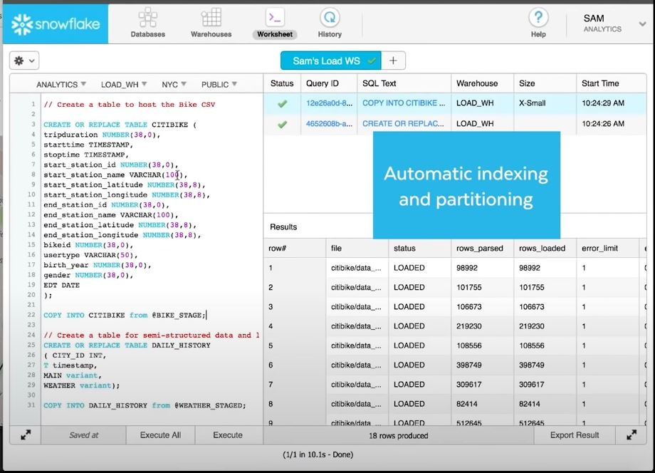
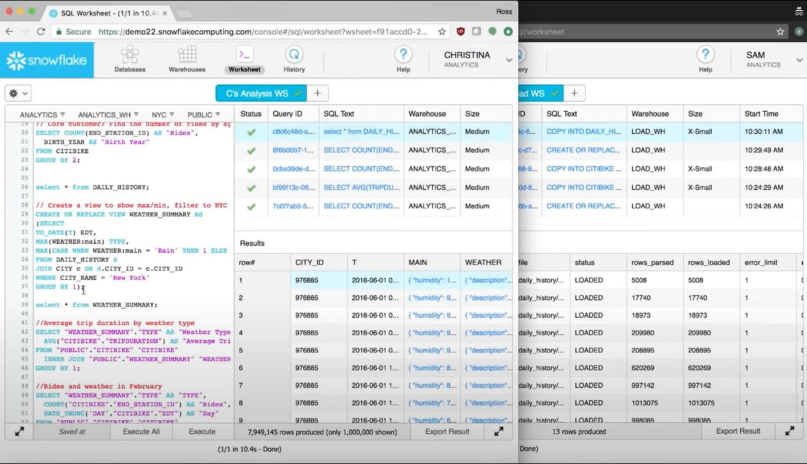

# Snowflake

### Defenition

`Snowflake` is Could based data warehousing platform and is SaaS (Software as a Service)

- Why Snowflake?

    - Faster, Easy to setup and Flexible
    - Its architecture built for the cloud
    - Multi-cluster architecture: Performance, Concurrency, Elasticy
    - It cares Authentication, Resource management, Optimization, Data Protection, Configuration

### Advantages

- Shared Disk and Shared nothing architecture
- Processes the Queries using Massivly Parallel processing compute clusters where the each node in the cluster stores a part of entire data set locally

### Three Layers of Snowflake

1. Database Storage 
    - Runs independently 
    - It can hold both Semistructured and Structured data
    - How the data stored
        - Organization 
        - File size
        - Structure
        - Compression 
        - Metadata
        - Statistics
    

2. Compute Layer
    - Made up virtual warehouse that execute data processing tasks required for queries.

    - Each warehouse can access all the data in the storage layer and then work independently. So, warehouses dont share and compete for resources. 

    - Non-Disruptive automatic scaling - while queries running resources can scale without the need to redistribute or rebalance the data in the storage layer

3. Cloud Layer
    - Ansi SQL and coordinates the entire system
    - Authententication
    - Metadata management
    - Infrosturecute management
    - Query parsing and optimization

By the design all layers are independely scalable.

   

# Snowflake Workflow

Snowfalke allows the users to collect more data than ever before

Shared data allows to load and analiz data as well at the same time

### Example workflow

- Abdullokh (Engineer)

        We have data in CSV file. 
        
        We loaded it into Snowfalke Database section

        Data can be loeaded to Snowflake warehouse from AWS S3 bucket 

        Creating warehouse
            - name
            - Size of warehouse (Small -> 1$ per hour)
            - Auto Suspend after no usage

        Using Ansi SQL standard we can create tables for our data and snowflake loads our data with automatic indexing and partitioning

        Ready to use
    
  

- Maftuna (Analist and Reporter)

    Creates new data warehouse with separate compute in shared data

    She can report and make analyzes ...

  

So in the end, She can suspend to avoid extra paing for unused time.